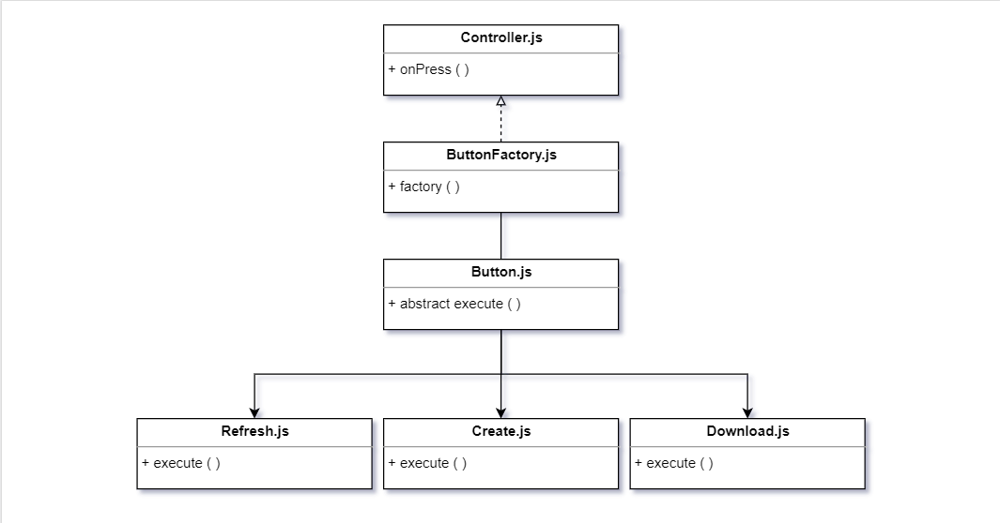

# ui5-button-factory
UI5 Button Factory

## Motivation

- reduce the complexity and workload of controllers. eg.: `onPress` is suitable for every button  
- reusability of components
- use of oriented-object and design pattern 

## Before start

- Make sure NodeJS is installed by running `node -v` in your terminal

If you do not see a version number output, install NodeJS before moving on. [https://nodejs.org/en/](nodejs.org/en/)

- In the application root, run `npm install` in your terminal to install its dependencies
- Still in the appliction root, run `npm run start` to start the application in browser at `localhost:3000`
- add the prefix `/webapp/index.html` in the url

## Class Diagram

## Creating Buttons

- when creating new buttons, create a new js class inheriting from `br.com.ButtonFactory.button.Button`;
- store the new class into the `button` folders
- implement the abstract method `execute`, otherwise the console will raise errors.
